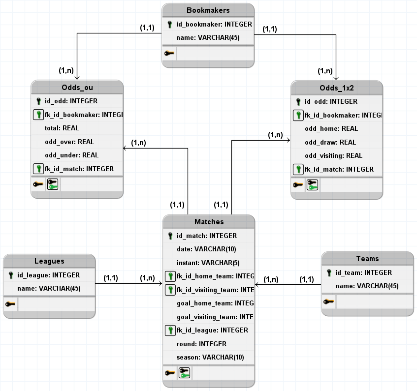

# soccer-scraper

Scraper escrito em python para coletar e armazenar em um bd dados de jogos de fultebol do site betexplorer.

### Modo de usar

A partir do terminal inserir o comando a baixo:

python main.py

Serão exibidas as opções de campeonatos disponíveis, você deve escolher uma das opções de 1-6:

* 1 - Premier League
* 2 - Serie A (Italy)
* 3 - Bundesliga
* 4 - LaLiga
* 5 - Ligue 1
* 6 - Série A (Brazil)

Por último, digite o número de temporadas anteriores à temporada 2020-2021 que deseja coletar (com o número máximo suportado sendo 11).

### Arquivos

* db.py: contém as funções que criam/consultam/modificam o banco de dados.
* my_exceptions.py: possui uma exceção específica para informar falha ao adicionar um registro no banco de dados.
* scraper.py: contém a classe Scraper com as funções responsáveis por coletar os dados.
* main.py: contém a função principal utilizada para executar o programa.

### Requisitos

* beautifulsoup4
* requests
* selenium

_*As versões específicas de cada lib estão no arquivo requirements.txt._

### Observações

* Em caso de problemas verificar o arquivo scraper_log.txt que é gerado ao final de uma execução com falha.

### Arquitetura do BD

